# iEEG Word-Encoding Geometry

**Representational geometry of serial position, reinstatement, and language-model
alignment in human intracranial EEG during free recall.**

Representational similarity analysis (RSA) of intracranial high-gamma activity recorded
while patients studied lists of words, pooling electrodes from **48 patients** into a single
high-dimensional **super-subject**. Built on the OpenNeuro dataset
[ds004789](https://openneuro.org/datasets/ds004789) (the **FR1** verbal free-recall task).

> The full analysis runs from **processed data — no preprocessing and no large download**.
> See [How to run](#how-to-run).

---

## Overview

In FR1 each list presents **12 words**, one at a time (~1.6 s per word, separated by a short
~0.5 s gap), followed by a distractor task and a free-recall period. This project analyses the
**word-presentation (encoding) phase and the gaps between words** — not the recall period — and
asks how the brain represents the studied words.

For every recording the pipeline extracts **high-gamma power (60–160 Hz)** — the iEEG correlate
of local cortical activation — epochs it around each list, and aligns it to a fixed 12-word
template. Channels that respond reliably across trials are kept, and the selected electrodes
from all subjects are concatenated into one super-subject, because no single patient has enough
spatial coverage alone. From that representation we ask:

1. **Word / position representations** — does the population carry a distinct, reproducible
   pattern for each serial position? *(first-order RSA)*
2. **Cross-session stability** — is that representation preserved in a second, independent
   session? *(second-order RSA between sessions)*
3. **The inter-word gap** — does the ~0.5 s gap after each word **maintain or reinstate** the
   pattern evoked by the word itself? *(word ↔ gap RSA)*
4. **Semantic structure** — does the neural representational geometry resemble that of **GPT-2**
   word embeddings? *(Notebook 2)*

---

## Key concepts

- **High-gamma (60–160 Hz).** The amplitude of high-gamma tracks local neural activation. It is
  extracted per channel and resampled to 100 Hz (preprocessing Stage 3).
- **Baseline normalisation.** The aligned high-gamma is stored in three forms: **raw** power,
  **normratio** (fold-change vs the pre-list baseline), and **dB** (10·log₁₀ of the ratio).
  `normratio` feeds the RSA; `dB` is used for the PSTH plots.
- **Population vector.** For a given word/position, the vector of activity across all selected
  super-subject electrodes — the neural representation of that item. Comparing population vectors
  yields the representational geometry.
- **RDM / RSM (first order).** A positions × positions matrix of (dis)similarities between the
  population vectors of the 12 serial positions within a session — which positions are
  represented similarly.
- **Second-order RSA.** Comparing two RDMs to each other (correlating their entries). Used to
  test whether the geometry is preserved **across sessions**, and whether it is **shared between
  the word and the gap** periods.
- **Word vs. gap windows.** Each word is shown ~1.6 s; a fixed ~0.5 s gap follows. Analysing the
  gap separately probes short-term **maintenance / reinstatement** of the just-presented word
  once it is off-screen.

---

## Subjects — why 48

The dataset contains many more patients, but the super-subject analysis needs a common,
comparable design. We use the **48 subjects who studied the same 300-word set** (25 lists × 12
words) in **at least two sessions**. That is what makes it valid to (a) compare the *same* words
across subjects when pooling electrodes, and (b) test representational **stability across
sessions**. Subjects with a different word set, or a single session, are excluded. The canonical
list lives in `lib.config.SUBJECTS`, and the download script fetches only these subjects and only
sessions `ses-0` / `ses-1`.

---

## Preprocessing

The preprocessing converts the raw, artifact-laden clinical iEEG into clean, time-locked
high-gamma matrices. It is a modular four-stage pipeline (`preprocessing/`). *The signal-
processing foundation is based on code by **Menashe Soffer**, extended for this project.*

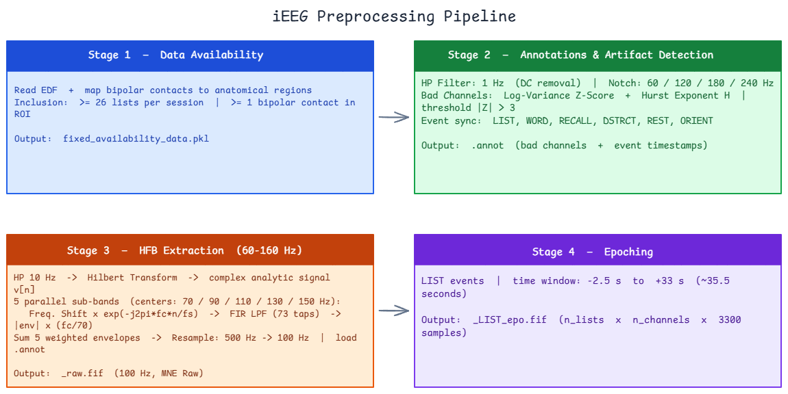

**Stage 1 — Data availability & electrode selection** (`step0_data_availability.py`).
Reads each subject's raw EDF and electrode-location table. A **bipolar** contact is the
difference of two adjacent electrodes, `x_c[n] = x_a[n] − x_b[n]`, and is assigned to an
anatomical region only if **both** endpoints fall in the same AAL region (border contacts are
excluded). A subject enters the pipeline only if they have enough valid lists per session and at
least one bipolar contact in the regions of interest.

**Stage 2 — Annotations & artifact detection** (`step1_annotations.py`).
Behavioural events are synchronised to signal samples and annotated (lists, words, countdown,
distractor, recall, rest). A **1 Hz high-pass** removes DC drift and **notch filters at
60/120/180/240 Hz** suppress line-noise harmonics. Bad channels are detected with two
complementary statistics computed over four equal time segments:
- **Log-Variance Z-score** — flags channels that are abnormally noisy or flat;
- **Hurst exponent (H)** — a clean neural signal sits near H ≈ 0.5; H → 1 betrays non-neural
  persistent processes (DC steps, saturation, mechanical artifacts).

A channel is rejected if `|Z| > 3` in at least one segment on at least one metric. The bad-channel
list plus all event timestamps are saved to a `.annot` file.

**Stage 3 — High-gamma extraction (60–160 Hz)** (`step2_hfb_signals.py`).
The core step. After a 10 Hz high-pass and the analytic (Hilbert) transform, the signal is split
into **five 20 Hz sub-bands** (centres 70/90/110/130/150 Hz) via frequency-shifting + a 73-tap FIR
filter; each sub-band envelope is extracted, **spectral-tilt corrected** (× fₖ/70), the five are
summed into one continuous HFB signal, and it is **resampled 500 → 100 Hz**. Bad channels and
annotations are attached, and the result is saved as an MNE Raw FIF.

**Stage 4 — Epoching & aligned matrices** (`step3_epochs.py`, `step4_aligned_matrices.py`).
The continuous HFB is cut into **list-locked epochs** (≈ −2.5 s to +33 s around each 12-word list)
→ a tensor of `(lists × channels × time)`. Each list is then stitched to a fixed template —
baseline + 12 word windows (160 samples, 1.6 s) + 11 gap windows (50 samples, 0.5 s) + tail — so
every list shares an identical time axis, and saved in three forms (`raw`, `normratio`, `dB`)
with per-channel inter-trial reliability scores.

---

## Analysis pipeline

The notebooks (`notebooks/`) are **pure orchestration** — every block is a call into `lib/`; all
logic lives in the library. The project's eight research stages:

| Stage | Notebook | What |
|---|---|---|
| Behavioural SPC | 01 | recall probability by position |
| Responsive electrodes (PSTH) | 01 | inter-trial reliability score |
| Super-subject + channel selection | 01 | 4,982 channels, two grand matrices |
| Serial-position RSA | 01 | split-half 12×12 RDM, decoding diagonal |
| Words vs Gaps (reinstatement) | 01 | cross-condition RDM, second-order geometry |
| Time-resolved + maintenance | 01 | 50 ms windows through the gap |
| Nearest-neighbor decoding | 01 | classifier-free position decoding |
| Neural ↔ GPT-2 RSA | 02 | 300×300 RSM vs 13 GPT-2 layers + permutation test |

---

## Results

### 1. Anatomical coverage of the super-subject
Electrodes from all subjects are mapped to MNI space and AAL regions; pooling overcomes the
sparse, clinically-determined coverage of any single patient.

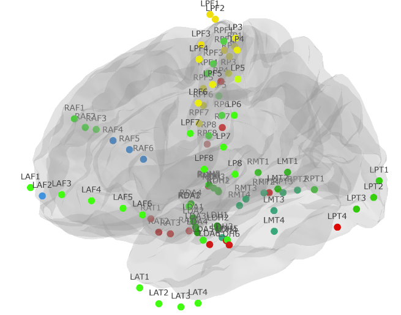

### 2. Behaviour: a clean primacy curve
Recall probability is high for the first position (~0.50) and decays by position 3; **recency is
absent** (the distractor task removes short-term memory). The two sessions overlap within SEM.

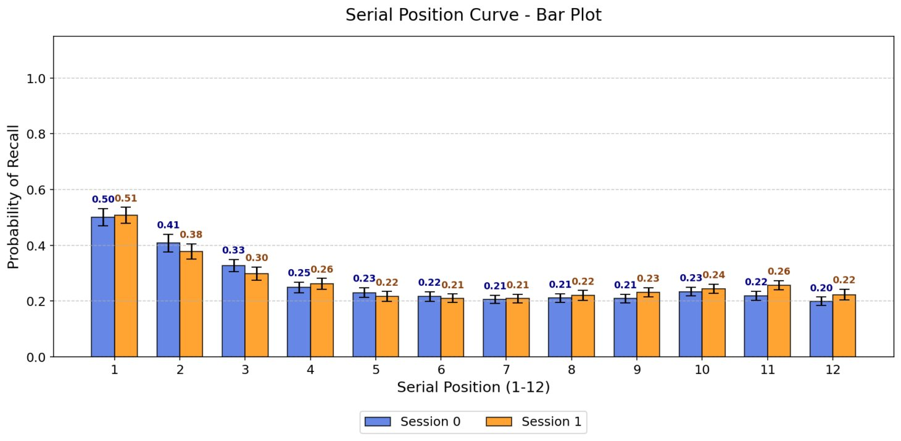

### 3. Single electrodes carry clear word responses…
A reliable electrode shows a crisp high-gamma response at every word onset (W1–W12) — the signal
is there at the single-channel level.

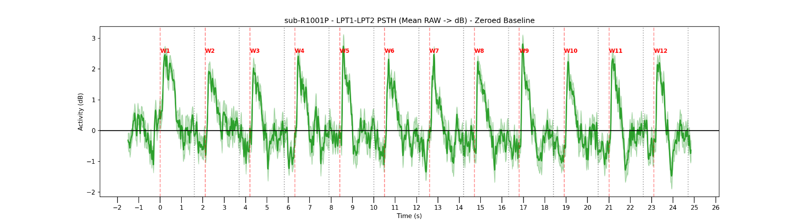

### 4. …but the population *average* is too blunt → RSA
Averaged over the top-100 channels the word-locked modulation is modest (±0.5 dB) and noisy. Mean
amplitude cannot characterise the serial-position code, so the analysis moves to the
**distributed pattern** across channels (RSA).

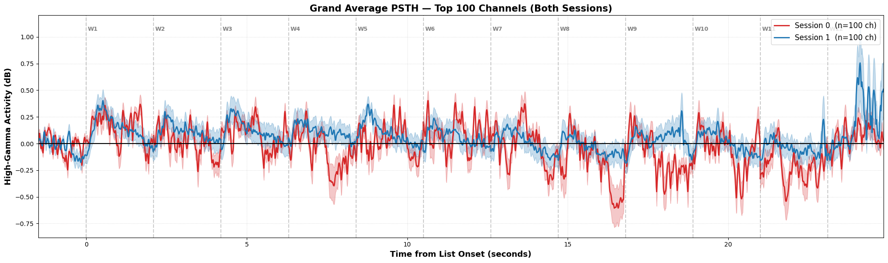

### 5. The neural code is dominated by primacy
Split-half reliability of each serial position (diagonal of the 12×12 RDM), with SEM over 10
iterations. **Position 1 is decoded far above all others (0.87 / 0.82** across the two sessions),
position 2 ≈ 0.5, and mid-list positions ≈ 0 — the neural code carries primacy, mirroring the
behavioural curve, and is reproduced across the two independent sessions.

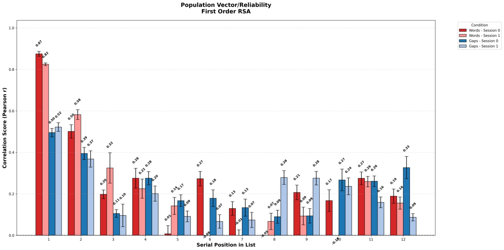

The **second-order RSA** matrices make the cross-session reproducibility explicit — every
position's relational profile in Session 0 is correlated with every position's in Session 1
(boxed diagonal = same position across days), separately for words and gaps. The early positions
(W1–W2 / G1–G2) are strongly consistent across the two sessions:

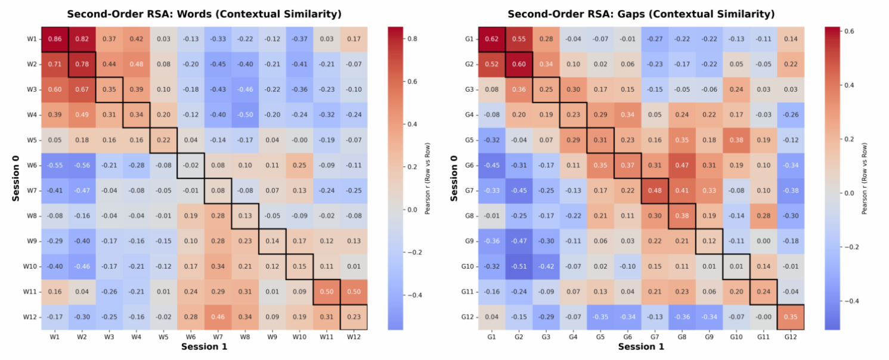

Reading off that boxed diagonal gives the per-position **relative-representation** bar plot — how
reproducible each position's geometry is across sessions, for words and gaps. Primacy dominates
again (W1 = 0.86, W2 = 0.78), and the early gap positions are consistent too (G1 = 0.62, G2 = 0.60):

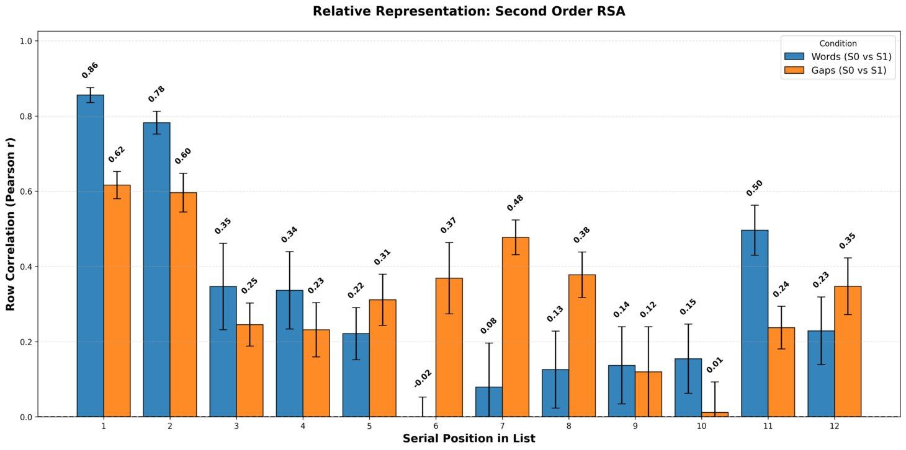

### 6. Reinstatement: the word's code persists into the gap
The **cross-condition RDM** correlates each word's pattern (position *i*) with each gap's pattern
(position *j*); the **diagonal is reinstatement** — the word-*i* code reappearing in gap *i*.
Early positions reinstate strongly, and the relational geometry is preserved into the silent gap
(words-vs-gaps global geometry r = **0.682 / 0.526**).

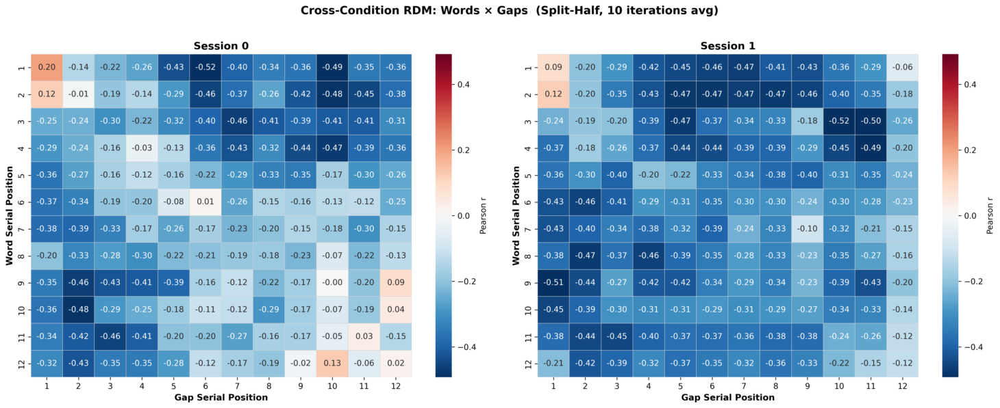

### 7. When does the trace decay through the gap?
Recomputing the representation in successive 50 ms windows of the gap: positions 1–2 stay positive
throughout and **position 1 even strengthens** (≈0.3 → 0.65), while mid-list positions hover near
zero.

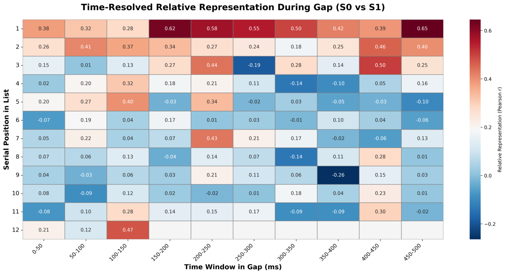

### 8. Direct decoding: words decode, gaps are a clean control
Nearest-neighbor decoding of serial position (each S1 pattern matched to the most-correlated S0
template). Word positions land on the diagonal (chance = 8.3%); the gap control collapses,
confirming the effect is specific to word encoding.

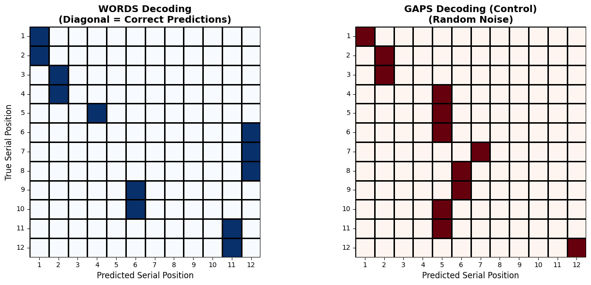

### 9. The brain's word geometry weakly matches GPT-2
Second-order RSA between the 300×300 neural RSM and each of GPT-2's 13 layers (Spearman). The
match is small but **significant and reproducible across sessions**, peaking at an **early layer
(L2 ≈ 0.019, p < 0.001**, vs a 1000-permutation null) and **collapsing at the output layer
(L12, n.s.)** — the brain's word organisation resembles GPT-2's *early–middle* semantic geometry,
not its final next-token representation.

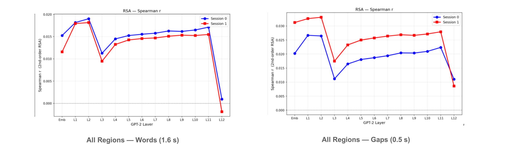

*(All 28 thesis figures are in [`docs/figures_book/`](docs/figures_book/); the notebooks
regenerate the full set under `results/`.)*

---

## Repository structure

```
ieeg-word-encoding-geometry/
├── preprocessing/     raw EDF -> annotations -> HFB -> epochs -> aligned matrices
├── lib/               analysis library (notebooks call only these)
├── notebooks/         01 reinstatement · 02 neural<->GPT-2 · 03 SWR (exploratory)
├── data/              README + download_data.py (+ committed electrode CSVs)
├── docs/figures_book/ thesis figures (shown above)
└── results/           regenerated figures + tables
```

---

## How to run

The whole analysis runs from a **~5 GB processed bundle** — no 67 GB raw download, no
preprocessing.

```bash
python -m venv .venv
.venv/Scripts/activate          # Windows; use 'source .venv/bin/activate' on Linux/Mac
pip install -r requirements.txt

# 1. fetch the processed-data bundle (Tier B) from Google Drive
pip install gdown
python data/download_data.py    # -> <data_root>/dr-processed

# 2. point the code at it
export IEEG_DATA_ROOT=/path/to/ieeg_data   # or write the path into .ieeg_data_root

# 3. run the notebooks
jupyter lab notebooks/01_words_gaps_reinstatement.ipynb
```

Three data tiers (details in [`data/README.md`](data/README.md)):

| Tier | What | Re-run scope |
|---|---|---|
| **A** | committed electrode CSVs + figures | reproduce figures, no download |
| **B** | ~5 GB processed matrices (`download_data.py`) | full analysis, **no preprocessing** |
| **C** | raw `ds004789` (67 GB) + `preprocessing/` | everything from scratch |

To regenerate from raw (Tier C), run the preprocessing stages in
`preprocessing/` (`step0…step4`). Notebook 2 (GPT-2) additionally needs `torch`/`transformers`;
embeddings and the permutation null are cached after the first run.

---

## Experiment & data source

The data come from the **Computational Memory Lab of Michael J. Kahana** (University of
Pennsylvania), collected under the **DARPA Restoring Active Memory (RAM)** program and released on
OpenNeuro as **[ds004789](https://openneuro.org/datasets/ds004789)**.

**Participants.** Neurosurgical patients with drug-resistant epilepsy who had intracranial
electrodes (depth and/or subdural) implanted clinically to localise the seizure focus. While
hospitalised for monitoring they volunteered for memory experiments, so each recording combines
clinically-driven coverage with a controlled task. Because coverage differs across patients, no
single subject spans enough of the brain — which is exactly why electrodes are pooled into a
super-subject.

**Task (FR1 — free recall).** Each list runs as: a countdown/orientation cue → **encoding** (12
words shown one at a time, ~1.6 s each with a short gap) → a **distractor** (arithmetic) task that
suppresses rehearsal → **free recall** (the patient says aloud as many words as they can, any
order). A session contains 25 lists (25 × 12 = 300 words). This project analyses the **encoding**
phase and the inter-word gaps; the recall phase is not analysed.

---

## Credits & citation

- **Dataset:** OpenNeuro [ds004789](https://openneuro.org/datasets/ds004789) (RAM FR1). Please
  cite the dataset and the associated Kahana-lab publications when using this code.
- **Preprocessing foundation:** based on code by **Menashe Soffer**, extended for this project.
- Built with [MNE-Python](https://mne.tools), [nilearn](https://nilearn.github.io), and
  [Hugging Face Transformers](https://huggingface.co/docs/transformers).
